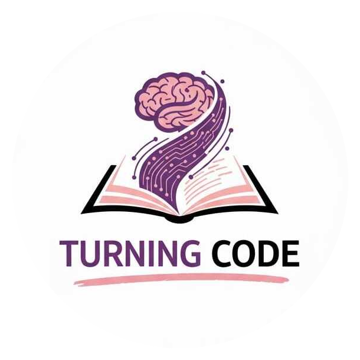

<p align="center">
  
</p>

<h1 align="center">🚀 TurningCode</h1>

<p align="center">
  <b>Platform belajar programming modern — dari nol hingga jadi programmer.</b>
</p>

<p align="center">
  
  
  
  
  
</p>

---

## 📖 Tentang Project

**TurningCode** adalah aplikasi web yang dirancang khusus untuk membantu siapa saja yang ingin **belajar menjadi programmer**. Nama "TurningCode" mencerminkan semangat *turning point* — titik balik di mana seseorang mulai memahami dunia pemrograman dan berubah menjadi seorang developer.

Platform ini menyajikan materi-materi programming secara **terstruktur dan bertahap**, mulai dari konsep dasar hingga topik lanjutan. Pengguna tidak hanya membaca materi, tetapi juga dapat mengatur **jadwal belajar harian**, melacak **progres** dan **riwayat belajar**, serta menyimpan materi **favorit** — sehingga proses belajar coding menjadi lebih terarah, konsisten, dan efektif.

Dibangun sebagai **Single Page Application (SPA)** menggunakan Laravel Blade Fragments, TurningCode memberikan pengalaman navigasi yang cepat dan mulus layaknya aplikasi modern.

Aplikasi ini memiliki dua sisi utama:
- **User Panel** — tempat pengguna belajar programming, mengatur jadwal, dan melacak progres belajar.
- **Admin Panel** — tempat admin mengelola seluruh konten materi pembelajaran dan berkomunikasi melalui global chat.

---

## ✨ Fitur

### 🔐 Autentikasi & Keamanan
- Registrasi akun dengan validasi
- Login dengan **OTP berbasis email** (dikirim ke Gmail)
- Verifikasi email wajib sebelum akses platform
- Role-based access control (`admin` / `user`)
- Middleware proteksi rute berdasarkan role

### 👨‍🎓 Panel User
- **Dashboard** — ringkasan aktivitas & widget waktu belajar
- **Jelajah Materi** — telusuri materi berdasarkan kategori utama → sub-kategori → konten detail
- **Detail Sub-Materi** — halaman konten pembelajaran lengkap
- **Jadwal Belajar (Study Schedule)** — CRUD jadwal dengan pola rekurensi (harian, mingguan, bulanan, kustom), toggle aktif/nonaktif, dan API jadwal hari ini
- **Notifikasi Real-Time** — pengingat waktu belajar & istirahat langsung di browser
- **Favorit** — tandai materi favorit untuk akses cepat
- **Riwayat Belajar** — lacak materi yang sudah dipelajari
- **Progres Belajar** — visualisasi kemajuan belajar
- **Profil & Akun** — edit profil, upload avatar, dan pengaturan akun
- **Navigasi Responsif** — navbar atas + bottom navigation untuk mobile

### 🛠️ Panel Admin
- **Dashboard Admin** — statistik dan overview platform
- **Kelola Main Materi** — CRUD kategori utama materi
- **Kelola Materi** — CRUD sub-kategori materi
- **Kelola Sub-Materi** — upload & manajemen konten pembelajaran dengan metadata
- **Global Chat** — sistem chat antar admin dengan fitur reply

### ⚙️ Arsitektur & Teknis
- **SPA dengan Blade Fragments** — navigasi halaman tanpa full reload
- **AJAX API Endpoints** — komunikasi asinkron untuk jadwal, chat, dan data materi
- **Vite + Tailwind CSS 4** — build tool modern dengan utility-first CSS
- **SQLite** — database ringan tanpa konfigurasi server tambahan

---

## 🛠️ Tech Stack

| Layer | Teknologi |
|-------|-----------|
| **Backend** | Laravel 13 (PHP 8.3+) |
| **Frontend** | Blade Templates, Tailwind CSS 4, Vanilla JS |
| **Build Tool** | Vite 8 |
| **Database** | SQLite |
| **HTTP Client** | Axios |
| **Dev Tools** | Laravel Pail, Laravel Pint, Concurrently |

---

## 🚀 Instalasi & Setup

### Prasyarat
- PHP 8.3+
- Composer
- Node.js & npm
- Git

### Langkah Instalasi

```bash
# 1. Clone repository
git clone https://github.com/your-org/TurningCode.git
cd TurningCode

# 2. Jalankan setup otomatis (install deps, generate key, migrate, build assets)
composer setup

# 3. Jalankan development server (Laravel + Queue + Pail + Vite secara bersamaan)
composer dev
```

Atau secara manual:

```bash
# Install dependencies
composer install
npm install

# Konfigurasi environment
cp .env.example .env
php artisan key:generate

# Jalankan migrasi database
php artisan migrate

# Build assets
npm run dev

# Jalankan server
php artisan serve
```

Akses aplikasi di `http://localhost:8000`

---

## 📁 Struktur Project

```
TurningCode/
├── app/
│   ├── Http/
│   │   ├── Controllers/
│   │   │   ├── Admin/              # AdminChatController, AdminMateriController, AdminSubMateriController
│   │   │   ├── AdminController.php # SPA admin & routing halaman
│   │   │   ├── AuthController.php  # Login, register, OTP, logout
│   │   │   └── UserController.php  # SPA user, profil, jadwal, favorit
│   │   └── Middleware/
│   │       └── EnsureRole.php      # Middleware role-based access
│   ├── Models/                     # User, MainMateri, Materi, SubMateri, StudySchedule, dll.
│   └── Providers/
├── config/
│   └── admin.php                   # Mapping email admin & OTP
├── database/
│   ├── migrations/                 # Schema: users, materis, schedules, chats, favorites, dll.
│   └── database.sqlite
├── resources/
│   ├── css/
│   ├── js/
│   └── views/
│       ├── auth/                   # Login, register, OTP, verify email
│       ├── layouts/
│       ├── spa/
│       │   └── fragments/          # Semua halaman SPA (dashboard, materi, jadwal, dll.)
│       └── welcome.blade.php       # Landing page
├── routes/
│   └── web.php                     # Definisi semua route (guest, user, admin)
├── composer.json
├── package.json
└── vite.config.js
```

---

## 👥 Kontributor

<table>
  <tr>
    <td align="center">
      <br>
      <sub><b>hanzz</b></sub>
    </td>
    <td align="center">
      <br>
      <sub><b>Jester</b></sub>
    </td>
    <td align="center">
      <br>
      <sub><b>ghostface</b></sub>
    </td>
    <td align="center">
      <br>
      <sub><b>Mychel09</b></sub>
    </td>
    <td align="center">
      <br>
      <sub><b>maousama</b></sub>
    </td>
  </tr>
</table>

---

## 📄 Lisensi

Project ini dikembangkan untuk keperluan pembelajaran dan bersifat open-source di bawah lisensi [MIT](https://opensource.org/licenses/MIT).

---

<p align="center">
  Dibangun dengan ❤️ oleh <b>Tim TurningCode</b>
</p>
