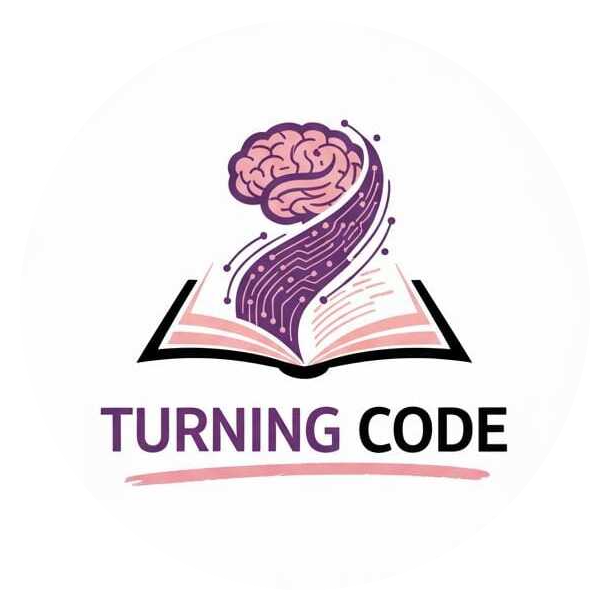

<p align="center">
  
</p>

<h1 align="center">🚀 TurningCode</h1>

<p align="center">
  <b>Elevate your coding journey from zero to hero with a modern, fast, and interactive learning platform.</b>
</p>

<p align="center">
  
  
  
  
</p>

---

## 📖 Vision & Philosophy

**TurningCode** bukan sekadar materi belajar di layar. Nama ini membawa filosofi **"The Turning Point"** — sebuah momen krusial di mana kebingungan berubah menjadi pemahaman, dan kode yang Anda tulis mulai "hidup". Kami membangun platform ini untuk menjadi jembatan bagi para pemula agar tidak terjebak dalam *tutorial hell*, melainkan bergerak maju melalui kurikulum yang terstruktur dan sistem manajemen belajar yang cerdas.

Platform ini mengusung estetika **Modern & Premium**, menggabungkan kecepatan navigasi **Single Page Application (SPA)** dengan keandalan backend Laravel. Setiap interaksi dirancang untuk memberikan *feedback* instan, meminimalkan hambatan teknis agar fokus Anda tetap pada satu hal: **Mempelajari Kode.**

---

## ✨ Highlight Fitur Unggulan

### 🌗 Seamless SPA Experience
Berbeda dengan web konvensional, TurningCode menggunakan arsitektur **Blade Fragments SPA**. Hal ini memungkinkan Anda berpindah halaman — dari membaca materi ke mengatur jadwal — tanpa merasakan jeda pemuatan halaman (*full page reload*). Transisinya halus, cepat, dan menghemat data.

### 🛡️ Authentication Level: Secure & Simple
Akses platform dilindungi oleh sistem **Email OTP (One-Time Password)**. Tidak ada lagi kerumitan menghafal password panjang yang sulit. Cek Gmail Anda, masukkan kodenya, dan Anda langsung berada di dalam lingkungan belajar yang aman.

### 🔔 Smart Notification System (Admin ONLY)
Admin dilengkapi dengan **Dashboard Control Tower**. Melalui ikon lonceng dinamis di header, Admin akan mendapatkan notifikasi real-time jika ada laporan masalah dari pengguna atau aktivitas kritis lainnya. Badge merah yang menyala memastikan tidak ada isu yang terlewatkan.

### 🚩 Interactive Issue Tracking
Sistem pelaporan masalah yang terintegrasi memungkinkan pengguna melaporkan bug atau kebingungan materi secara instan. Admin dapat mengelola laporan ini langsung dari Dashboard menggunakan fitur **Accept/Resolve** — mempercepat sirkulasi perbaikan demi pengalaman belajar yang lebih baik.

### ⌨️ Integrated Web Terminal (CMD)
Untuk kebutuhan pengelolaan tingkat lanjut, Admin memiliki akses ke **Web Terminal Overlay**. Jalankan perintah sistem, cek status server, atau lakukan tugas administratif langsung di browser tanpa perlu membuka SSH Client eksternal.

---

## 🛠️ Tech Stack & Architecture

### Backend Powerhouse
- **Laravel 13**: Framework PHP paling modern untuk skalabilitas dan keamanan tinggi.
- **SQLite**: Database yang ringan dan sangat cepat untuk lingkungan pengembangan portable.
- **Queued Mail Services**: Pengiriman OTP dan verifikasi dilakukan di latar belakang (*background process*) menggunakan Worker, sehingga aplikasi tetap responsif.

### Frontend Aesthetics
- **Tailwind CSS 4**: Menggunakan utility-first CSS terbaru untuk styling yang presisi dan modern.
- **Vite 8**: Build tool super cepat yang menangani kompilasi aset dalam hitungan milidetik.
- **Vanilla JavaScript SPA Engine**: Logika navigasi kustom yang ringan tanpa overhead framework JS berat seperti React atau Vue di sisi Admin.

---

## 📁 Project Structure

```
TurningCode/
├── app/
│   ├── Http/
│   │   ├── Controllers/
│   │   │   ├── Admin/              # Controllers: Chat, Materi, SubMateri
│   │   │   ├── AdminController.php # Admin SPA & Routing logic
│   │   │   ├── AuthController.php  # Authentication & OTP logic
│   │   │   └── UserController.php  # User SPA & Dashboard logic
│   │   └── Middleware/
│   │       └── EnsureRole.php      # Role-based protection
│   ├── Models/                     # User, Materi, SubMateri, Schedule, IssueReport, dll.
│   └── Providers/
├── config/
├── database/
│   ├── migrations/                 # Database Schema
│   └── database.sqlite             # Lightweight portable DB
├── resources/
│   ├── js/                         # SPA_admin.js & SPA_user.js
│   └── views/
│       ├── spa/
│       │   └── fragments/          # SPA UI components (blade fragments)
│       └── layouts/                # Main SPA layouts
├── routes/
│   └── web.php                     # Unified web & API routes
├── composer.json
├── package.json
└── vite.config.js
```

---

## 🚀 Quick Start Guide

### 1. Prasyarat Sistem
- **PHP**: >= 8.3
- **Database**: SQLite (built-in support di Laravel)
- **Node.js**: >= 18.x
- **Composer**: Dependency manager untuk PHP

### 2. Instalasi Cepat

```bash
# Clone the repository
git clone https://github.com/Hackivers/TurningCode.git
cd TurningCode

# Setup environment (Pilih salah satu)
# Cara Otomatis:
composer setup

# Cara Manual:
composer install
npm install
cp .env.example .env
php artisan key:generate
php artisan migrate --seed
```

### 3. Menjalankan Server
Kami merekomendasikan penggunaan **Concurrently** untuk menjalankan semua proses (Laravel Server + Vite + Queue Worker) dengan satu perintah:

```bash
composer dev
```
Atau secara terpisah:
- `php artisan serve` (Web Server)
- `npm run dev` (Vite Assets)
- `php artisan queue:work` (Email Worker)

---

## ⚙️ Environment Configuration

| Key | Description |
|-----|-------------|
| `APP_URL` | Domain atau URL akses aplikasi (default: http://localhost:8000) |
| `MAIL_HOST` | Host SMTP untuk pengiriman OTP (Rekomendasi: smtp.gmail.com) |
| `MAIL_PASSWORD` | App Password dari Google Account (Jangan gunakan password asli email!) |
| `SESSION_DRIVER` | Mengatur masa aktif sesi login pengguna (default: file) |

---

## 🗺️ Future Roadmap

- [ ] **Quiz Integration**: Uji pemahaman materi dengan Passing Threshold 80%.
- [ ] **Gamification System**: Dapatkan EXP dan Rank (Pemula -> Legend) setiap kali menyelesaikan sub-materi.
- [ ] **Dark Mode Toggle**: Dukungan penuh tema gelap untuk kenyamanan mata saat belajar di malam hari.
- [ ] **Mobile App Wrapper**: Transformasi SPA menjadi aplikasi mobile menggunakan Capacitor.

---

## 📄 License & Contribution

Project ini bersifat **Open Source** di bawah lisensi [MIT](https://opensource.org/licenses/MIT). Kami sangat menghargai kontribusi dari komunitas, baik berupa *bug reporting*, saran desain, maupun penambahan materi pembelajaran.

<p align="center">
  <b>Crafted with passion by the TurningCode Dev Team.</b>
</p>
